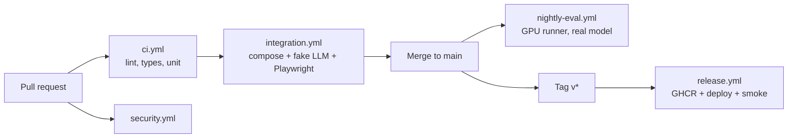
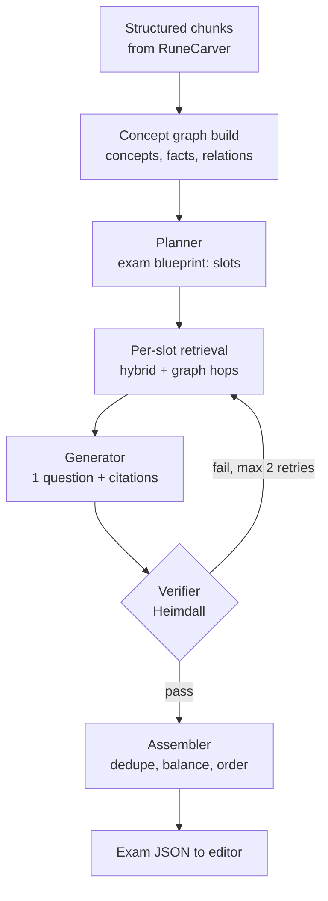
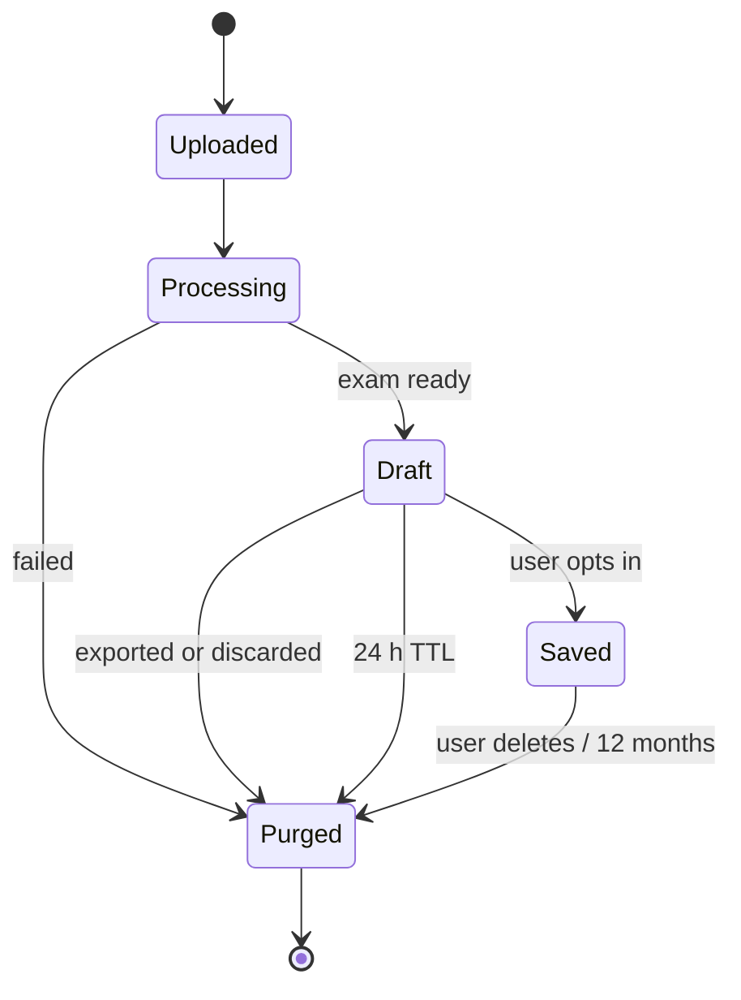
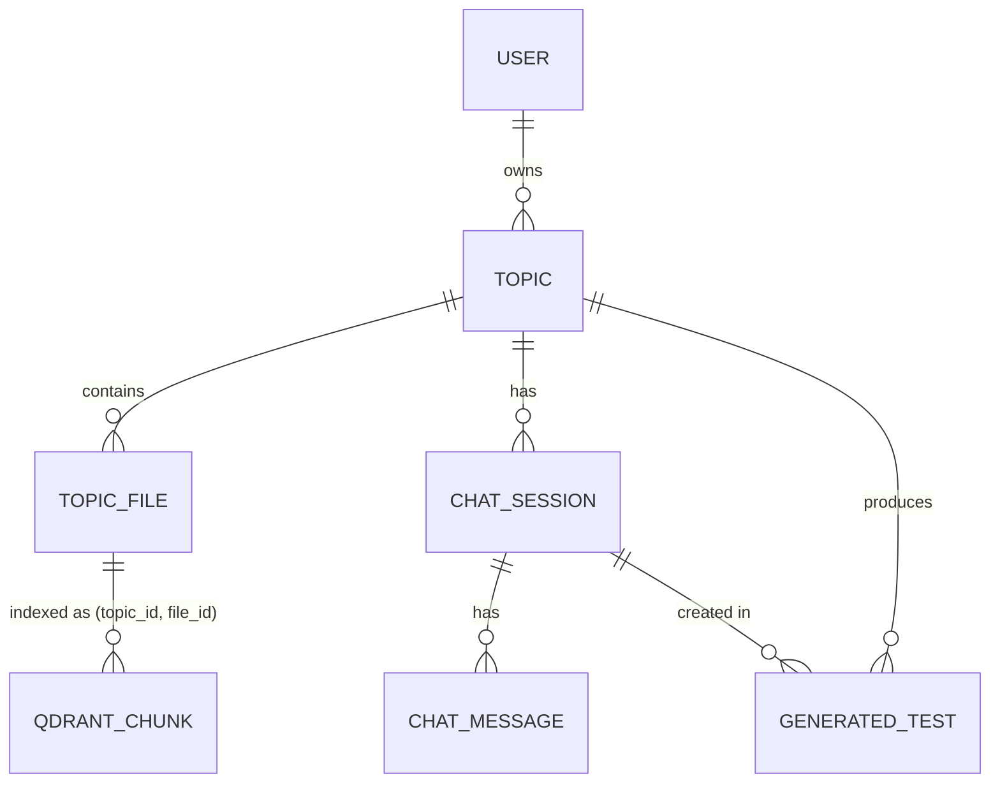
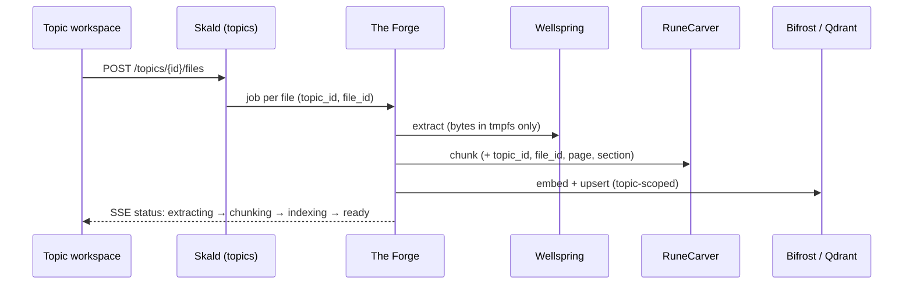

# Project Mimir — Semester Roadmap & Architecture Plan

Last updated: 2026-09-22 · Owner: @Deatron01

> **Tracking:** every task ID in this plan is a GitHub issue, linked in the tables below. Work is planned on the [Mimir Semester project board](https://github.com/users/Deatron01/projects/5) (fields: Status, Priority, Module, Estimate, Sprint) and grouped into sprint milestones S1–S7. Use the issue templates in `.github/ISSUE_TEMPLATE/` for new work and record decisions in [`docs/adr/`](adr/).

## Executive summary

Mimir works end-to-end as a single-user demo, but it is not yet safe for more than one user at a time: the plan spends the first 4 weeks on correctness, isolation and privacy, then 6 weeks on the AI core and UX, then 4 weeks on hardening. The review below is based on the repo as of commit 86030e3 (last commit 9 June 2026, ~1,700 lines of Python across 6 services, ~1,650 lines of JSX).

**Headline plan**

- **Weeks 1–4, Foundation:** fix the blocking defects, add real auth, make every request session-scoped, move CI to where GitHub runs it, one-command local stack that fits 8 GB VRAM.
- **Weeks 5–10, Intelligence and UX:** replace single-shot RAG with a plan → retrieve → generate → verify agent loop over a per-document knowledge graph; ship the frontend overhaul (i18n HU/EN, light/dark for all 6 palettes, question editor).
- **Topic workspace (S2–S5):** test creation moves into isolated Topics with multi-file ingestion, per-topic chat and history, hard `topic_id` filtering and GDPR cascade delete (section 9).
- **Weeks 11–14, Production:** zero-retention pipeline audited end to end, load tests, horizontal scaling, E2E suite gating releases.

### Current-state audit (what the code does today)

| Severity | Module | Finding | Impact |
| --- | --- | --- | --- |
| Critical | Bifrost | One global Qdrant collection; every `/ingest` call deletes it (`clear_database`) | Two users at once get each other's documents in their tests: a data leak and a GDPR breach |
| Critical | Bifrost | Job state lives in a Python dict (`generation_jobs`) and Qdrant runs `:memory:` | Restart loses all jobs; cannot run more than 1 replica |
| Critical | Frontend | Login is simulated (`setTimeout` then `login({email})`); user stored in localStorage | Anyone can "log in" as any email and list that user's tests |
| Critical | Skald | `/tests?user_id=` and `/tests/download/{id}` have no auth check; CORS `*` | Anyone who guesses an email or ID can download others' exams (IDOR) |
| Critical | Repo | `services/skald/storage/history.db` and 12 generated PDFs are committed to git | User emails and generated content in version history; needs history rewrite |
| High | The Forge | `CREATE TABLE IF NOT EXISTS task_queue ( ... )` is literal placeholder SQL | Queue table never exists; the worker loop fails every 5 s; nothing uses it |
| High | The Forge | `audit_logs` stores full prompt + RAG context (user document text) forever | Conflicts with zero-retention requirement |
| High | Heimdall | Ollama URL and CORS origins are Markdown-mangled (`"[http://…](http://…)"`) | Local fallback never works; CORS list invalid |
| High | Heimdall | Judge scores the whole exam 1–10 but nothing acts on the score | "Hallucination filter" is advisory only; bad exams still ship |
| High | RuneCarver | Embeds the whole document with `truncation=True, max_length=512` | Sentences after ~512 tokens get zero vectors, so chunk boundaries past page ~1 are effectively random |
| High | CI | Pipeline lives at `workflows/ci.yml`, not `.github/workflows/` | CI has never run; tests step is a placeholder `echo` |
| Medium | Bifrost / Heimdall / Wellspring | User content sent to `genai.uni-obuda.hu` (3 × 120B models) with local Ollama only as fallback | Third-party processor: needs a DPA/legal basis, or a local-only mode |
| Medium | Quality | May 2026 E2E report: all 3 difficulty levels generated 1 question vs a baseline of 4 | Model ignores requested count; no retry or validation on count/type |
| Medium | Compose | Credentials hard-coded in compose; every service port published to host; frontend commented out; Ollama runs outside Docker | Onboarding is manual and error-prone |
| Medium | Frontend | Streamlit app (`app.py`, `auth.py`) and React app live side by side; API URLs hard-coded (`api.mimir-ai.hu`) | Two frontends, one fake auth, can't point to a local stack |
| Low | Docs | README promises MinIO, Kubernetes HPA, JWT, DOCX support; none are wired up | Expectations vs reality gap for new team members |

The hand-written core (VLM → OCR cascade in Wellspring, semantic chunker, native PDF/Moodle XML) is a good base; most of the work is making it multi-user, private and testable rather than rewriting it.

## 1. Task breakdown by module

Track everything in **GitHub Projects (v2)**, not Jira: the repo already lives on GitHub, it is free for a small team, and issues close automatically from PRs (`Closes #12`) and show CI status. Jira only pays off if the university requires it.

**Board setup (one project, "Mimir Semester")**

- Custom fields: `Status` (Backlog, Ready, In progress, In review, Done), `Priority` (P0 blocker, P1 must, P2 should, P3 nice), `Module`, `Estimate` (story points 1/2/3/5/8), `Iteration` (2-week sprints, 7 total).
- Views: Board by Status (daily), Table grouped by Module (planning), Roadmap by Iteration (supervisor demo).
- Issue templates in `.github/ISSUE_TEMPLATE/`: Feature, Bug, Research spike (time-boxed, output = decision record in `docs/adr/`).
- Labels: `module:*`, `type:feature|bug|spike|chore|security`, `gdpr`, `good-first-issue`.
- Definition of Done: code reviewed by 1 teammate, tests added and CI green, README/ADR updated, no new secrets or user data in the repo.

IDs below are suggested issue titles prefixes; points are relative sizing, not hours.

### Platform and DevOps (PLT)

| ID | Task | Pri | Pts | Acceptance criteria |
| --- | --- | --- | --- | --- |
| [PLT-01](https://github.com/Deatron01/Project-Mimir/issues/1) | Purge `skald/storage/` (history.db + 12 PDFs) and `.DS_Store` from git history with `git filter-repo`; extend `.gitignore` | P0 | 2 | `git log --all -- services/skald/storage` is empty; all members re-cloned |
| [PLT-02](https://github.com/Deatron01/Project-Mimir/issues/2) | Move CI to `.github/workflows/`; split into per-service jobs (see section 4) | P0 | 3 | CI runs on every PR and blocks merge on failure |
| [PLT-03](https://github.com/Deatron01/Project-Mimir/issues/3) | Monorepo tooling: `uv` workspace for Python, one `pyproject.toml` per service, shared `ruff` + `mypy` config, `pre-commit` hooks | P1 | 3 | `pre-commit run --all-files` passes locally and in CI |
| [PLT-04](https://github.com/Deatron01/Project-Mimir/issues/4) | Rewrite `docker-compose.yml` with profiles, healthchecks, `.env.example`, no hard-coded secrets (section 2) | P0 | 5 | New member runs `make up` on an RTX 3070 Ti and gets a working stack in < 20 min |
| [PLT-05](https://github.com/Deatron01/Project-Mimir/issues/5) | Branching model: `main` protected, short-lived feature branches, squash merge, conventional commits | P1 | 1 | Branch protection rules active |
| [PLT-06](https://github.com/Deatron01/Project-Mimir/issues/6) | Observability: structured JSON logs (no document text), OpenTelemetry traces with one `request_id` across services, Prometheus + Grafana in `observability` profile | P2 | 5 | One trace shows upload → export latency per service |
| [PLT-07](https://github.com/Deatron01/Project-Mimir/issues/7) | Production deploy target: Compose on university VM behind Cloudflare Tunnel now; Helm chart + HPA as stretch | P2 | 8 | Tagged release deploys via GitHub Actions |

### Identity and API Gateway (GW)

| ID | Task | Pri | Pts | Acceptance criteria |
| --- | --- | --- | --- | --- |
| [GW-01](https://github.com/Deatron01/Project-Mimir/issues/8) | New `auth` service (FastAPI): register, email verify, login, refresh; Argon2 hashes; Postgres `users` table. Retire Streamlit `auth.py` | P0 | 8 | Fake login in `Login.jsx` removed; tokens are real |
| [GW-02](https://github.com/Deatron01/Project-Mimir/issues/9) | JWT (short-lived access 15 min, refresh 7 days in httpOnly cookie); gateway validates via Nginx `auth_request` or Traefik ForwardAuth | P0 | 5 | Every `/api/v1/*` call without a valid token returns 401 |
| [GW-03](https://github.com/Deatron01/Project-Mimir/issues/10) | Single public origin: frontend and API served under one host (`/` and `/api`), so CORS is no longer needed in services | P1 | 2 | CORS middleware removed from all services |
| [GW-04](https://github.com/Deatron01/Project-Mimir/issues/11) | Rate limiting per user and per IP (Nginx `limit_req` or Redis token bucket); upload cap 20 MB matching README | P1 | 3 | 11th generate request/minute returns 429 |
| [GW-05](https://github.com/Deatron01/Project-Mimir/issues/12) | Public API contract: one OpenAPI spec aggregated from services, versioned under `/api/v1` | P2 | 3 | Spec published in CI artifacts; frontend client generated from it |
| [GW-06](https://github.com/Deatron01/Project-Mimir/issues/13) | Remove direct service ports (8001–8005, 5432, 6379, 9000) from host in prod compose | P1 | 1 | Only gateway port exposed |

### Wellspring — extraction (WEL)

| ID | Task | Pri | Pts | Acceptance criteria |
| --- | --- | --- | --- | --- |
| [WEL-01](https://github.com/Deatron01/Project-Mimir/issues/14) | Add DOCX support (python-docx) and PPTX (python-pptx) to match README | P1 | 3 | Sample DOCX/PPTX extract with headings preserved |
| [WEL-02](https://github.com/Deatron01/Project-Mimir/issues/15) | Emit structured output: pages, headings, tables, figures with page numbers (not one string) | P1 | 5 | Downstream chunks carry `page` and `section` metadata |
| [WEL-03](https://github.com/Deatron01/Project-Mimir/issues/16) | Local VLM route (e.g. a small Qwen-VL via Ollama) behind a `LOCAL_ONLY` flag so no page image leaves the machine | P1 | 5 | With `LOCAL_ONLY=true` no outbound call to genai.uni-obuda.hu |
| [WEL-04](https://github.com/Deatron01/Project-Mimir/issues/17) | Stream uploads to a tmpfs scratch dir or keep in memory; never MinIO in the default path (section 6) | P0 | 3 | No file on disk after request ends |
| [WEL-05](https://github.com/Deatron01/Project-Mimir/issues/18) | File validation: magic-byte check, page limit, zip-bomb / PDF JS rejection, ClamAV optional | P1 | 3 | Malformed-file test corpus rejected with 4xx |
| [WEL-06](https://github.com/Deatron01/Project-Mimir/issues/19) | Async processing: page-level parallelism with a bounded worker pool; progress events | P2 | 3 | 50-page scanned PDF processed with progress updates |

### RuneCarver — chunking (RUN)

| ID | Task | Pri | Pts | Acceptance criteria |
| --- | --- | --- | --- | --- |
| [RUN-01](https://github.com/Deatron01/Project-Mimir/issues/20) | Fix 512-token truncation: embed per sentence (batched) instead of the whole document | P0 | 3 | Unit test: 10-page text yields non-zero embeddings for every sentence |
| [RUN-02](https://github.com/Deatron01/Project-Mimir/issues/21) | Hungarian-aware sentence splitting (abbreviations like "dr.", "pl.", "stb."; e.g. `pysbd` or HuSpaCy) | P1 | 3 | Golden-file test on HU and EN samples |
| [RUN-03](https://github.com/Deatron01/Project-Mimir/issues/22) | Structure-aware chunking: respect Wellspring headings/tables, then semantic split inside sections; add parent–child chunks (small for retrieval, large for context) | P1 | 5 | Chunks carry `section_path`, `parent_id` |
| [RUN-04](https://github.com/Deatron01/Project-Mimir/issues/23) | Share one embedding service with Bifrost instead of loading e5 twice (save ~1 GB RAM) | P1 | 3 | Only one process holds the embedding model |
| [RUN-05](https://github.com/Deatron01/Project-Mimir/issues/24) | Chunking evaluation harness (boundary F1 vs hand-labelled docs) | P2 | 3 | Score reported in CI nightly |

### Bifrost — AI core and retrieval (BIF)

| ID | Task | Pri | Pts | Acceptance criteria |
| --- | --- | --- | --- | --- |
| [BIF-01](https://github.com/Deatron01/Project-Mimir/issues/25) | ~~Session-scoped collections~~ **Superseded by TOP-03** (topic-scoped tenant filtering, section 9) | — | — | — |
| [BIF-02](https://github.com/Deatron01/Project-Mimir/issues/26) | Move job state from in-memory dict to Redis (TTL) or Postgres; stateless API replicas | P0 | 3 | Bifrost restart does not lose running jobs' status |
| [BIF-03](https://github.com/Deatron01/Project-Mimir/issues/27) | LLM provider abstraction (`LLMClient` with OpenAI-compatible, Ollama, vLLM backends), config-driven model list; drop duplicated fallback code | P1 | 5 | Switching provider = env var change |
| [BIF-04](https://github.com/Deatron01/Project-Mimir/issues/28) | Structured output with schema enforcement (Pydantic model → JSON Schema → Ollama `format` / `response_format`); retry on validation failure | P0 | 3 | 0 unparseable responses in 50-run eval |
| [BIF-05](https://github.com/Deatron01/Project-Mimir/issues/29) | Hybrid retrieval: BM25 + dense + reciprocal rank fusion + cross-encoder rerank | P1 | 5 | Recall@5 improves on eval set (section 5) |
| [BIF-06](https://github.com/Deatron01/Project-Mimir/issues/30) | Agentic generation loop and knowledge graph (full detail in section 5) | P1 | 13 | Question count/type always match request; grounding score ≥ target |
| [BIF-07](https://github.com/Deatron01/Project-Mimir/issues/31) | Replace hard-coded fallback "AI overloaded" fake exam with a proper error status | P1 | 1 | Frontend shows a retry state, not a fake question |
| [BIF-08](https://github.com/Deatron01/Project-Mimir/issues/32) | Prompt registry: prompts as versioned files (HU + EN), not f-strings; prompt version stored in metadata | P2 | 2 | `system_prompt_version` reflects real file hash |

### Heimdall — validation (HEI)

| ID | Task | Pri | Pts | Acceptance criteria |
| --- | --- | --- | --- | --- |
| [HEI-01](https://github.com/Deatron01/Project-Mimir/issues/33) | Fix mangled URLs/CORS; configurable judge endpoint | P0 | 1 | Local fallback reachable |
| [HEI-02](https://github.com/Deatron01/Project-Mimir/issues/34) | Deterministic validators first: JSON schema, answer counts per type (MCQ 4/1 correct, TF 2, open 1), duplicate detection, language check | P0 | 3 | Rule failures returned per question, not one score |
| [HEI-03](https://github.com/Deatron01/Project-Mimir/issues/35) | Per-question grounding check: each correct answer must be entailed by a cited chunk (NLI model or LLM judge with citation) | P1 | 5 | Ungrounded questions are regenerated, not shipped |
| [HEI-04](https://github.com/Deatron01/Project-Mimir/issues/36) | Distractor quality and difficulty rubric (plausibility, no "all of the above", Bloom level) | P2 | 3 | Rubric scores stored for analytics (no source text) |
| [HEI-05](https://github.com/Deatron01/Project-Mimir/issues/37) | Prompt-injection screening on uploaded text (instructions inside documents) | P1 | 3 | Red-team corpus does not change output format |

### The Forge — orchestration (FRG)

| ID | Task | Pri | Pts | Acceptance criteria |
| --- | --- | --- | --- | --- |
| [FRG-01](https://github.com/Deatron01/Project-Mimir/issues/38) | Decide: keep Postgres `SKIP LOCKED` queue (fix schema) or adopt Redis Streams / arq. Spike + ADR | P0 | 2 | ADR merged |
| [FRG-02](https://github.com/Deatron01/Project-Mimir/issues/39) | Real schema with migrations (Alembic): `jobs`, `job_steps`, status, attempts, `expires_at`; idempotent retries with backoff; dead-letter state | P0 | 5 | Kill a worker mid-job; job resumes on another worker |
| [FRG-03](https://github.com/Deatron01/Project-Mimir/issues/40) | Make Forge the only orchestrator: upload → extract → chunk → index → generate → validate → export as a job graph (frontend stops calling 4 services in sequence) | P1 | 8 | `Chat.jsx` makes 1 POST + 1 SSE subscription |
| [FRG-04](https://github.com/Deatron01/Project-Mimir/issues/41) | GPU admission control: one GPU semaphore per LLM backend so jobs queue instead of OOM (section 2) | P0 | 3 | 5 parallel jobs on 8 GB: no OOM, jobs queue |
| [FRG-05](https://github.com/Deatron01/Project-Mimir/issues/42) | Replace AI-Act audit log contents with metadata only (model, prompt version, hashes, scores, timings); 30-day TTL job | P0 | 2 | No document text in `audit_logs` |
| [FRG-06](https://github.com/Deatron01/Project-Mimir/issues/43) | Progress events over SSE (`/jobs/{id}/events`) | P1 | 3 | UI shows real stage progress |

### Skald — export (SKA)

| ID | Task | Pri | Pts | Acceptance criteria |
| --- | --- | --- | --- | --- |
| [SKA-01](https://github.com/Deatron01/Project-Mimir/issues/44) | Stateless export by default: return bytes, do not write PDF to disk; opt-in "save to library" stores only the final exam JSON with owner ID and expiry | P0 | 3 | No files under `storage/` after export |
| [SKA-02](https://github.com/Deatron01/Project-Mimir/issues/45) | Replace SQLite with Postgres; enforce ownership from JWT `sub` (not `user_id` query param) | P0 | 3 | Downloading another user's test returns 404 |
| [SKA-03](https://github.com/Deatron01/Project-Mimir/issues/46) | Answer-key PDF, randomised variants (A/B groups), shuffled answer order | P1 | 3 | Two variants from one exam in one click |
| [SKA-04](https://github.com/Deatron01/Project-Mimir/issues/47) | Moodle XML validation against Moodle import (all 3 types), plus GIFT and Aiken formats; QTI 2.1 as stretch | P1 | 3 | Import test in a local Moodle Docker passes |
| [SKA-05](https://github.com/Deatron01/Project-Mimir/issues/48) | Math rendering: allow LaTeX where needed and render (MathJax in XML, matplotlib/mathtext in PDF) instead of stripping `$` | P2 | 3 | Formula samples render in PDF and Moodle |
| [SKA-06](https://github.com/Deatron01/Project-Mimir/issues/49) | Localised PDF templates (HU/EN labels, school header, logo) | P2 | 2 | Template chosen from UI language |

### Frontend (FE)

Full UX plan in section 7; tasks here for the board.

| ID | Task | Pri | Pts | Acceptance criteria |
| --- | --- | --- | --- | --- |
| [FE-01](https://github.com/Deatron01/Project-Mimir/issues/50) | Delete Streamlit app (`app.py`, `auth.py`, `requirements.txt`); rename package from `uxintace-saas-landing` | P0 | 1 | One frontend |
| [FE-02](https://github.com/Deatron01/Project-Mimir/issues/51) | Migrate to TypeScript + typed API client generated from OpenAPI; TanStack Query for server state | P1 | 5 | No `fetch` calls in page components |
| [FE-03](https://github.com/Deatron01/Project-Mimir/issues/52) | Runtime config (`/config.json` or relative `/api`) instead of build-time `VITE_*` URLs and hard-coded `api.mimir-ai.hu` | P0 | 2 | Same image runs locally and in prod |
| [FE-04](https://github.com/Deatron01/Project-Mimir/issues/53) | Real auth flow wired to GW-01 (login, register, verify, logout, token refresh) | P0 | 3 | Protected routes reject expired sessions |
| [FE-05](https://github.com/Deatron01/Project-Mimir/issues/54) | Generation options (count, types, difficulty, language, Fast/Thorough) inside the topic workspace chat; upload moves to the topic uploader (see TOP-12, section 9) | P1 | 8 | Replaces free-text-only prompting inside a topic |
| [FE-06](https://github.com/Deatron01/Project-Mimir/issues/55) | Question editor: inline edit, reorder (drag), regenerate one question, show source citation | P1 | 8 | Edit persists to export |
| [FE-07](https://github.com/Deatron01/Project-Mimir/issues/56) | i18n HU/EN | P1 | 5 | See section 7 |
| [FE-08](https://github.com/Deatron01/Project-Mimir/issues/57) | Theme system: light/dark per palette | P1 | 5 | See section 7 |
| [FE-09](https://github.com/Deatron01/Project-Mimir/issues/58) | Accessibility pass (WCAG 2.2 AA) | P1 | 3 | axe: 0 serious violations |
| [FE-10](https://github.com/Deatron01/Project-Mimir/issues/59) | Privacy UX: consent on upload, retention notice, "delete my data" button | P0 | 2 | Linked to GDPR tasks |

### Topic workspace (TOP)

The Topic workspace epic has its own section with data model, API, isolation rules and tasks: see [section 9](#9-topic-workspace-epic).

### Shared (SHR)

| ID | Task | Pri | Pts | Acceptance criteria |
| --- | --- | --- | --- | --- |
| [SHR-01](https://github.com/Deatron01/Project-Mimir/issues/60) | `mimir-common` Python package: Pydantic DTOs (Exam, Question, Chunk, JobEvent), settings loader, logging with PII redaction, HTTP client with retries | P1 | 5 | All services import DTOs from one place |
| [SHR-02](https://github.com/Deatron01/Project-Mimir/issues/61) | JSON Schemas generated from DTOs, consumed by frontend types and Heimdall | P1 | 2 | Single source of truth for exam format |

## 2. Local deployment on 8–12 GB GPUs

The GPU runs exactly one thing, the LLM, and one model at a time; everything else (embeddings, reranker, OCR, services) runs on CPU. Today the code asks for `qwen2.5:14b` with a 16k context: that needs about 9 GB of weights plus about 3 GB of KV cache, so it spills to CPU on the 3070 Ti and sits at the OOM edge on the 3060.

### VRAM budget per hardware tier (approximate)

| Tier | GPU | LLM (Q4\_K\_M) | Context | KV cache (q8\_0) | Est. total VRAM | Headroom for Windows desktop |
| --- | --- | --- | --- | --- | --- | --- |
| `gpu8` | RTX 3070 Ti 8 GB | 7–8B instruct (Qwen2.5-7B class), ~4.7 GB | 16k | ~0.5 GB | ~5.8 GB incl. runtime | ~2 GB |
| `gpu12` | RTX 3060 12 GB | 14B instruct (Qwen2.5-14B class), ~9 GB | 8k | ~0.8 GB | ~10.3 GB incl. runtime | ~1.5 GB |
| `gpu12-fast` | RTX 3060 12 GB | 7–8B, 2 parallel slots | 2 × 8k | ~0.5 GB | ~6 GB | ~6 GB |
| `cloud` | any / none | Uni GenAI API or other OpenAI-compatible endpoint | — | — | 0 | — |

KV figures are computed for fp16 and halved for `q8_0`; real use varies ±10% by runtime version. Research spike AI-R1 (section 3) picks the exact models by measuring quality on your HU/EN eval set, since newer 8B-class models may beat older 14B ones.

### Rules that prevent OOM

1. **Ollama inside Compose** as the `llm` service with an NVIDIA device reservation (works on Docker Desktop + WSL2). Keep a documented override to point `LLM_BASE_URL` at a native Windows Ollama for anyone whose WSL GPU passthrough misbehaves.
2. **Ollama settings per tier** in `.env.<tier>`: `OLLAMA_MAX_LOADED_MODELS=1`, `OLLAMA_NUM_PARALLEL=1` (2 on `gpu12-fast`), `OLLAMA_FLASH_ATTENTION=1`, `OLLAMA_KV_CACHE_TYPE=q8_0`, `OLLAMA_KEEP_ALIVE=30m`. Context length set per request from the tier config, never hard-coded in Python.
3. **One model for generator and judge.** Heimdall uses the same local model with a different prompt, so there is no model swap between steps (a swap costs 5–15 s and briefly doubles VRAM pressure).
4. **VLM pages batched before generation.** Wellspring's vision model and the text LLM never co-reside: Forge runs all VLM pages of a document first, then releases it (`keep_alive: 0`) before generation starts. On `gpu8` default to Tesseract and use VLM only if `LOCAL_VLM=true`.
5. **GPU semaphore in The Forge** (FRG-04): at most N concurrent LLM calls per backend (N = `OLLAMA_NUM_PARALLEL`). Extra jobs wait in the queue instead of crashing the runtime.
6. **Embeddings and reranker on CPU.** multilingual-e5-base (~280M params) and a small cross-encoder run fine on CPU for single-user loads; load them once in a shared `embedder` service (RUN-04) instead of twice.
7. **CPU-only PyTorch wheels** in every non-GPU image (`--index-url https://download.pytorch.org/whl/cpu`). This cuts each image from several GB to about 1 GB and speeds up pulls.
8. **Container memory limits** (`mem_limit`) and `OMP_NUM_THREADS`/`torch.set_num_threads` per service so CPU inference doesn't starve the desktop. Document a `.wslconfig` with `memory=12GB` for 16 GB RAM machines.

### Compose layout

| Profile | Services | When to use |
| --- | --- | --- |
| (default) | postgres, redis, qdrant (tmpfs storage), gateway, auth, wellspring, runecarver, embedder, bifrost, heimdall, forge-api, forge-worker, skald, frontend (Nginx build) | Always |
| `gpu` | `llm` (Ollama) + `llm-init` one-shot job that pulls the tier's model | Local LLM on your GPU |
| `cloud` | none extra; sets `LLM_BASE_URL` to the GenAI endpoint | No GPU, or quick UI work |
| `dev` | Vite dev server with hot reload; services with bind mounts and `uvicorn --reload` via `compose.override.yml` | Day-to-day coding |
| `observability` | Prometheus, Grafana, Tempo/Jaeger | Performance work |
| `tunnel` | cloudflared | Demo / prod only, never by default |

MinIO leaves the default stack: with zero retention there is nothing to store long-term (section 6).

**Operational details**

- Every service gets a `/health` (liveness) and `/ready` (model loaded, DB reachable) endpoint; `depends_on: condition: service_healthy` replaces start-order guessing and the 5 s sleep in The Forge.
- `.env.example` is committed; `.env` is generated by `make init` with random passwords. No credentials in `docker-compose.yml`.
- Only the gateway (`:8080`) and optionally Vite (`:5173`) bind to the host, on `127.0.0.1`.
- Model files live in a named volume (`ollama-models`) so they survive `docker compose down`.
- Prebuilt images published to GHCR by CI, so teammates run `docker compose pull` instead of building torch images locally.

**Makefile targets (one command each):** `make init` (env + secrets), `make up TIER=gpu8`, `make up-cloud`, `make dev`, `make down`, `make nuke` (wipe volumes), `make smoke` (runs the E2E smoke test), `make logs s=bifrost`, `make vram` (prints `nvidia-smi` usage).

### Onboarding checklist (Windows)

1. NVIDIA driver current, Docker Desktop with WSL2 backend, `nvidia-smi` works inside `docker run --gpus all`.
2. `git clone`, `make init`, pick `TIER` from the table above.
3. `make up TIER=gpu8` → first run pulls images and the model (~5 GB).
4. `make smoke` passes → open `http://localhost:8080`.

## 3. Semester implementation plan

Seven 2-week sprints take Mimir from single-user demo to v1.0: multi-user safe by 2026-10-25, beta with the new AI core by 2026-11-22, feature freeze on 2026-12-20, v1.0 by 2027-01-15. Sprint 1 is assumed to start Monday 28 September; Sprint 7 falls after the winter break.

**Prioritisation rule:** P0 security and privacy defects first, then anything that blocks measurement (eval set, CI), then quality (AI core), then polish (UX). Each sprint keeps about 20% capacity for bugs and review.

| Sprint | Dates | Theme | Build (issue IDs) | Research spikes | Exit criteria |
| --- | --- | --- | --- | --- | --- |
| S1 | 28 Sep – 11 Oct | Stop the bleeding | PLT-01, PLT-02, PLT-04, PLT-05, BIF-02, RUN-01, HEI-01, FE-01, FE-03 | R1, R2 | CI green on every PR; no shared vector store; `make up` works on both GPU types |
| S2 | 12 – 25 Oct | Identity and privacy | GW-01, GW-02, GW-03, GW-06, FE-04, FE-10, SKA-01, SKA-02, WEL-04, FRG-01, FRG-02, FRG-04, FRG-05, TOP-01, TOP-02, TOP-03, TOP-04 | R3, R6, TOP-18 | **M1 multi-user alpha:** real login, topics isolated in Qdrant with cascade delete, no OOM with 5 concurrent jobs |
| S3 | 26 Oct – 8 Nov | AI core v1 | BIF-03, BIF-04, BIF-05, BIF-07, HEI-02, RUN-02, RUN-03, RUN-04, SHR-01, SHR-02, FE-02, WEL-01, TOP-05, TOP-06, TOP-07, TOP-10, TOP-11 | R4, R7 | Requested question count and types always honoured; multi-file topics ingest and chat in isolation; naive-RAG baseline recorded |
| S4 | 9 – 22 Nov | Agentic generation | BIF-06, HEI-03, FRG-03, FRG-06, FE-05, FE-07, FE-08, TOP-08, TOP-12, TOP-13, TOP-14, TOP-15 | R5 | **M2 beta:** new pipeline beats baseline on eval set; topic workspace in HU/EN with themes; isolation suite green |
| S5 | 23 Nov – 6 Dec | Editor and exports | FE-06, SKA-03, SKA-04, WEL-02, WEL-03, HEI-04, HEI-05, BIF-08, TOP-09, TOP-16, TOP-17 | — | Teacher can edit, regenerate one question, export PDF + Moodle; topic lifecycle E2E green; privacy notice updated for topics |
| S6 | 7 – 20 Dec | Hardening | PLT-06, GW-04, GW-05, FE-09, RUN-05, WEL-05, WEL-06, load and security tests | — | **M3 feature freeze / RC:** GDPR checklist signed off; p95 latency and error-rate targets met |
| S7 | 4 – 15 Jan | Release | Bug fixes only, SKA-05, SKA-06, PLT-07, docs, demo script | — | **v1.0** tagged and deployed; eval results written up for TDK / paper |

### Research spikes

Each spike is time-boxed (max 3 days) and ends with a short ADR in `docs/adr/`.

| ID | Question | Output | Sprint |
| --- | --- | --- | --- |
| [R1](https://github.com/Deatron01/Project-Mimir/issues/93) | Which local model per GPU tier gives the best HU/EN question quality within the VRAM budget? | Ranked shortlist with VRAM, tokens/s and eval score; default model per tier | S1 |
| [R2](https://github.com/Deatron01/Project-Mimir/issues/94) | Keep the Postgres `SKIP LOCKED` queue or switch to Redis Streams / arq? | ADR (recommendation: keep Postgres, it is already there and fits the load) | S1 |
| [R3](https://github.com/Deatron01/Project-Mimir/issues/95) | What does "a good test" mean, measurably? | 30–50 document eval set (HU + EN, 3 difficulties), metrics definition (section 5) | S2 |
| [R4](https://github.com/Deatron01/Project-Mimir/issues/96) | LightRAG-style lightweight graph vs Microsoft GraphRAG vs custom concept graph on Postgres | ADR + prototype on 3 eval docs; cost per document on 8 GB | S3 |
| [R5](https://github.com/Deatron01/Project-Mimir/issues/97) | Grounding check for Hungarian: multilingual NLI cross-encoder vs LLM-as-judge with citations | Accuracy on 100 labelled Q/A pairs; latency | S4 |
| [R6](https://github.com/Deatron01/Project-Mimir/issues/98) | Legal basis and processor terms for the university GenAI API; privacy notice text | Short memo reviewed with the university data protection officer | S2 |
| [R7](https://github.com/Deatron01/Project-Mimir/issues/99) | Hungarian sentence splitter (pysbd, HuSpaCy, custom rules) | Golden-file accuracy comparison | S3 |

### Team rhythm

- Sprint planning (1 h) and review/demo (30 min) every other Monday; async daily updates in the project board.
- Every PR under ~400 changed lines; one reviewer; CI must pass.
- Supervisor demo at M1, M2 and M3 using the Roadmap view.

## 4. Testing and CI/CD

Every PR runs fast, deterministic checks with a fake LLM; the real model is only exercised in a nightly eval job on a team PC's GPU. That keeps CI under ~10 minutes and free, while still catching quality regressions in the AI.

### Frameworks

| Layer | Backend (FastAPI / Python) | Frontend (React / Vite) |
| --- | --- | --- |
| Static checks | ruff (lint + format, replaces Black/Flake8), mypy (strict on `mimir-common`) | ESLint, Prettier, `tsc --noEmit` |
| Unit | pytest, pytest-asyncio, hypothesis (property tests for chunker, Moodle XML escaping), pytest-cov | Vitest, React Testing Library, user-event |
| Service / API | FastAPI TestClient / httpx `AsyncClient`, respx to mock outbound HTTP, Schemathesis fuzzing from each service's OpenAPI | MSW (Mock Service Worker) for API mocks |
| Integration | testcontainers-python (Postgres, Redis, Qdrant); fake OpenAI-compatible LLM stub returning canned exam JSON | Component tests with real i18n and theme providers |
| End-to-end | Playwright against the full Compose stack with the fake LLM | Same Playwright suite: login → upload → generate → edit → export |
| Accessibility / visual | — | `@axe-core/playwright`; screenshot snapshots for 6 palettes × 2 modes × 2 languages on 3 key pages |
| AI quality | Eval harness (Ragas or DeepEval, decided in R3) + custom metrics from section 5 | — |
| Load | k6 (or Locust) scripts: 20 concurrent users upload + generate | — |
| Security | gitleaks, pip-audit, Bandit rules via ruff, Trivy image scan, CodeQL, Dependabot | `npm audit`, CodeQL, Dependabot |

**Must-have test cases (write these first)**

- Two users and two topics never retrieve each other's chunks, chat or tests, and a deleted topic leaves no residue (TOP-08).
- After a job finishes or fails, no document bytes remain in Postgres, Redis, Qdrant, tmpfs or logs (zero-retention test, section 6).
- Unauthenticated or other-user access to any `/api/v1/*` resource returns 401/404.
- Generated exam always has the requested count and per-type answer shape (MCQ 4 with 1 correct, TF 2, open 1).
- Chunker produces non-zero embeddings for every sentence of a 20-page document (RUN-01 regression).
- Moodle XML output imports cleanly (validated against the XSD / a Moodle container in nightly).

### GitHub Actions workflows

| Workflow | Trigger | Jobs | Gate |
| --- | --- | --- | --- |
| `ci.yml` | every PR, push to `main` | `dorny/paths-filter` → matrix per changed service: ruff, mypy, pytest unit + coverage; frontend lint, typecheck, Vitest, build | Required; coverage ≥ 70% on changed service, rising to 80% by M3 |
| `integration.yml` | PR to `main` | Build images (Buildx + GHA cache), `docker compose --profile ci up` with fake LLM, API integration tests, Playwright smoke; upload Playwright traces on failure | Required |
| `security.yml` | PR + weekly | gitleaks, CodeQL (Python + JS), pip-audit, npm audit, Trivy on images | Required for high/critical |
| `nightly-eval.yml` | nightly + manual | Runs on a **self-hosted runner** (a team PC, label `gpu8`): real model, full eval set, posts scores to the job summary, stores JSON for trend | Fails if any metric drops > 5% vs `main` baseline |
| `release.yml` | tag `v*` | Build and push images to GHCR with SBOM, deploy to the university VM, run smoke test, auto-rollback on failure | Manual approval via GitHub Environment `production` |

PRs are gated by the top row; the AI's real quality is tracked nightly, and releases only ship from tagged `main`.

**Setup notes**

- The fake LLM is a ~50-line FastAPI stub in `tests/fakes/llm/`, selected by `LLM_BASE_URL`; it lets E2E run on GitHub-hosted runners with no GPU.
- Existing `tests/tester.py` becomes the seed of the nightly eval; its baseline JSONs move to `eval/datasets/`. Generated results go to CI artifacts, never committed.
- Secrets only in GitHub Environments; the self-hosted runner uses only synthetic or public-domain eval documents, never user data.
- Branch protection: required checks `ci`, `integration`, `security`; 1 approving review; linear history.

## 5. Advanced AI core: blueprint-driven agentic GraphRAG

Replace today's single prompt (top-3 chunks → whole exam in one call) with a plan → retrieve → generate → verify loop that works one question at a time over a per-document concept graph. This fixes the two measured failures (wrong question count, no grounding check) and suits 8 GB GPUs, because each call needs only ~2–4k tokens of context instead of the whole document.

Each slot loops back to retrieval with the verifier's feedback until it passes or is replaced; the graph is scoped to the topic and deleted with it.

### Components

1. **Concept graph (GraphRAG-lite).** For each chunk the LLM extracts concepts, definitions, atomic facts and typed relations (is-a, part-of, causes, contrasts-with), each citing its chunk ID. Near-duplicate concepts are merged by embedding similarity. Section-level summaries give "big picture" context for harder questions. The graph is held in Postgres tables keyed by `topic_id` and deleted by the topic cascade (section 9). Full Microsoft GraphRAG community detection is likely too heavy for 8 GB; spike R4 decides.
2. **Planner (exam blueprint).** Converts the request into explicit slots: `{concept, type, Bloom level, difficulty}`. It picks concepts for coverage (central concepts first, every major section represented) and maps difficulty to Bloom levels (Easy: remember/understand, Medium: apply, Hard: analyse/evaluate). Count and type are now guaranteed by construction, not by prompt.
3. **Iterative retrieval per slot.** Query = concept + slot intent → BM25 + dense (e5) fused with reciprocal rank fusion → cross-encoder rerank → plus 1-hop graph neighbours. A sufficiency check asks "does this context support a question of this Bloom level?"; if not, it reformulates and retrieves again (max 2 hops).
4. **Generator.** One question per call with structured output enforced by JSON schema. It must cite the chunk IDs supporting the correct answer. MCQ distractors come from sibling concepts in the graph (same parent, different fact), so they are plausible but provably wrong.
5. **Verifier (Heimdall v2).** In order, cheapest first: schema and shape rules → grounding (the key is entailed by the cited chunk) → distractor check (no distractor is entailed) → blind answer test (the model answers its own question from the context without seeing the key and must choose the keyed option) → language and meta-reference check. Failures return a reason to the generator.
6. **Assembler.** Removes near-duplicates (similarity > 0.9), balances sections, orders easy → hard, attaches citations for the editor UI.

**Orchestration choice.** Keep Mimir's hand-written philosophy: implement the loop as an explicit state machine inside The Forge (states and transitions persisted per job step, resumable after crashes). LangGraph is the alternative if the team prefers a library; either way, the state machine is the same.

**Budget on `gpu8` (estimate, to be measured in R1):** 10 questions ≈ graph build (1 call per chunk) + ~3 calls per question ≈ 40–60 calls. Offer a "Fast" mode (skip blind answer test, graph only for long documents) and a "Thorough" mode.

### Evaluation (proves it beats naive RAG)

| Metric | Definition | Target by M2 |
| --- | --- | --- |
| Format compliance | % exams with exact requested count and per-type shape | 100% |
| Grounding rate | % questions whose key is entailed by a cited chunk (NLI + spot-checked by humans) | ≥ 95% |
| Distractor validity | % distractors that are wrong but on-topic | ≥ 90% |
| Answerability | % questions the blind-answer model gets right with context | ≥ 90% |
| Coverage | % document sections with at least 1 question (for exams ≥ 10 questions) | ≥ 80% |
| Duplicate rate | % question pairs with similarity > 0.9 | ≤ 2% |
| Difficulty calibration | Agreement between requested and judged difficulty | ≥ 70% |
| Human rating | 2 teachers rate 1–5 on a 60-question sample, blind to pipeline | ≥ 4.0 avg |
| Latency / VRAM | p50 time for 10 questions on `gpu8`; peak VRAM | < 4 min; < 7 GB |

Run the same eval on the current pipeline first (S3) to get the baseline; the comparison is publishable material for TDK.

### AI core tasks

| ID | Task | Pri | Pts | Sprint |
| --- | --- | --- | --- | --- |
| [AI-01](https://github.com/Deatron01/Project-Mimir/issues/62) | Eval dataset: 30–50 HU/EN docs (lecture notes, legal text, code), gold concepts, reference questions | P0 | 5 | S2 |
| [AI-02](https://github.com/Deatron01/Project-Mimir/issues/63) | Eval harness + metrics above, JSON results, trend chart in nightly job | P0 | 5 | S2–S3 |
| [AI-03](https://github.com/Deatron01/Project-Mimir/issues/64) | Baseline run of current naive pipeline | P0 | 1 | S3 |
| [AI-04](https://github.com/Deatron01/Project-Mimir/issues/65) | Planner + blueprint schema; guarantees count/type | P0 | 3 | S3 |
| [AI-05](https://github.com/Deatron01/Project-Mimir/issues/29) (= BIF-05) | Hybrid retrieval + reranker (BIF-05) | P1 | 5 | S3 |
| [AI-06](https://github.com/Deatron01/Project-Mimir/issues/66) | Concept/fact/relation extraction prompt + schema; entity merge | P1 | 8 | S4 |
| [AI-07](https://github.com/Deatron01/Project-Mimir/issues/67) | Graph store (Postgres tables, topic-scoped) + neighbour queries | P1 | 3 | S4 |
| [AI-08](https://github.com/Deatron01/Project-Mimir/issues/68) | Per-slot generator with citations and graph-based distractors | P1 | 5 | S4 |
| [AI-09](https://github.com/Deatron01/Project-Mimir/issues/69) | Verifier chain (HEI-02, HEI-03) with retry feedback | P1 | 5 | S4 |
| [AI-10](https://github.com/Deatron01/Project-Mimir/issues/70) | Job state machine in Forge; resumable steps; Fast/Thorough modes | P1 | 5 | S4 |
| [AI-11](https://github.com/Deatron01/Project-Mimir/issues/71) | Single-question regenerate endpoint for the editor | P1 | 2 | S5 |
| [AI-12](https://github.com/Deatron01/Project-Mimir/issues/72) | Ablation study: graph on/off, verifier on/off, model tiers | P2 | 3 | S6 |

## 6. GDPR zero-retention and scalability

Uploaded content lives only inside one processing session: in memory or tmpfs, encrypted with a per-session key, under a TTL. It is deleted when the job ends, and a janitor deletes anything missed within 15 minutes. Only account data, opt-in saved exams and content-free audit metadata persist. **Once the Topic workspace ships (section 9), topic data (chunks, embeddings, graph, chat) is kept until the user deletes it or the topic goes inactive; raw files are still never stored.** (This is an engineering plan, not legal advice; R6 confirms the legal side with the university's data protection officer.)

### Data inventory and lifetime

| Data | Where it lives | Lifetime | How it is removed |
| --- | --- | --- | --- |
| Uploaded file bytes | Wellspring process memory / tmpfs | Seconds (until text is extracted) | Buffer freed; tmpfs file unlinked in `finally` block |
| Extracted text, chunks, embeddings, concept graph | Today: memory, cleared after each job. With topics: Qdrant / Postgres tagged `topic_id`, encrypted volumes | Today: job duration, max 60 min. With topics: until file/topic deletion or inactivity (TOP-18) | Today: purge after job. With topics: cascade delete (TOP-04) + inactivity purge (TOP-09) |
| Prompts and raw LLM outputs | Worker memory only | One call | Never persisted; never logged |
| Generated exam JSON (draft) | Redis, encrypted with session key | Until export or 24 h idle | Delete on export/discard; key expiry makes leftovers unreadable (crypto-shredding) |
| Saved exams (opt-in "My tests") | Postgres, owner-scoped | Until user deletes, max 12 months | User delete; account delete; yearly purge job |
| Account data (email, password hash) | Postgres `users` | Account lifetime | "Delete account" endpoint cascades everything |
| AI audit metadata | Postgres `audit_events` | 30 days (confirm in R6) | Scheduled purge; no document text, only SHA-256 of doc, model, prompt version, scores, timings |
| Logs and traces | stdout / Grafana stack | 7 days | Redaction filter; request bodies never logged; no `user_id` in URLs |

Every path ends in Purged; the only branch that keeps anything is an explicit user opt-in, and it keeps just the exam.

### Privacy tasks

| ID | Task | Pri | Sprint |
| --- | --- | --- | --- |
| [GDPR-01](https://github.com/Deatron01/Project-Mimir/issues/73) | Purge existing personal data: git history (PLT-01), `audit_logs` rows with document text, Skald `storage/` on every deployed host | P0 | S1 |
| [GDPR-02](https://github.com/Deatron01/Project-Mimir/issues/74) | ~~Session model~~ **Superseded** by the topic model (TOP-01, TOP-04, TOP-18) | — | — |
| [GDPR-03](https://github.com/Deatron01/Project-Mimir/issues/75) | Janitor job in The Forge: deletes expired sessions across Redis, Qdrant, Postgres; emits a metric `purged_sessions_total` | P0 | S2 |
| [GDPR-04](https://github.com/Deatron01/Project-Mimir/issues/76) | Automated zero-retention test: upload a document with a canary string, finish the job, then scan Postgres, Redis, Qdrant, volumes and logs for it; runs in `integration.yml` | P0 | S2 |
| [GDPR-05](https://github.com/Deatron01/Project-Mimir/issues/77) | Log redaction middleware in `mimir-common`; ban `print()` of payloads via ruff rule; Nginx log format without query strings | P1 | S2 |
| [GDPR-06](https://github.com/Deatron01/Project-Mimir/issues/78) | LLM egress policy: `LOCAL_ONLY=true` by default; external GenAI only when enabled per deployment, with processor terms confirmed and a UI notice | P0 | S2 |
| [GDPR-07](https://github.com/Deatron01/Project-Mimir/issues/79) | Data subject rights: export my data, delete my account (cascades), delete a saved test | P1 | S3 |
| [GDPR-08](https://github.com/Deatron01/Project-Mimir/issues/80) | Documents: privacy notice HU/EN (replace placeholder `Privacy.jsx`), record of processing activities, lightweight DPIA, breach procedure | P1 | S3–S6 |
| [GDPR-09](https://github.com/Deatron01/Project-Mimir/issues/81) | Cookies: only the essential refresh-token cookie, so no consent banner needed; no third-party analytics | P1 | S2 |
| [GDPR-10](https://github.com/Deatron01/Project-Mimir/issues/82) | Upload consent step: "I have the right to process this document; it is deleted after generation" | P1 | S2 |

### Scalability

The fix is the same pattern everywhere: stateless API replicas, all state in Postgres/Redis/Qdrant, and slow work in queue-driven workers that scale on queue depth. The GPU is the bottleneck, so the system is designed to queue gracefully rather than to go faster.

| Component | Today | Target design | Scales by |
| --- | --- | --- | --- |
| API services (Wellspring, Bifrost API, Skald, auth) | Single container, state in memory/SQLite | Stateless FastAPI, several uvicorn workers, state in shared stores | Replica count behind gateway (CPU-based HPA) |
| The Forge | One loop, broken queue table | `forge-api` + worker pools per queue: `cpu` (OCR, chunk, embed), `llm` (GPU), `export` | Workers per queue; KEDA on queue depth in K8s, `--scale` in Compose |
| LLM serving | Ollama on a dev PC or university API | Ollama for dev; **vLLM** in production for continuous batching (much higher throughput per GPU); LiteLLM-style router across GPU nodes with the GenAI API as overflow when allowed | GPU nodes; concurrency limits per node |
| Vector store | Qdrant `:memory:`, one global collection | Qdrant server, one collection payload-partitioned by `topic_id` (`is_tenant`), encrypted volume | Qdrant replicas; short-lived data keeps it small |
| Progress to UI | Frontend polls every few seconds | SSE through the gateway, events fanned out via Redis pub/sub so any replica can serve any stream | Stateless |
| Postgres | Direct connections per request | PgBouncer, connection pools, indexes on `jobs(status, created_at)` | Vertical first; read replica if needed |

**Resilience and fairness**

- Per-user limit of 2 active jobs; the UI shows queue position; the gateway returns 429 beyond rate limits.
- Timeouts on every outbound call, retries with exponential backoff and jitter, idempotency keys on job creation, circuit breaker on each LLM backend.
- Dead-letter state for jobs that fail 3 times; the user sees a clear error, not a fake exam.

**Load targets (validated with k6 in S6):** 20 concurrent users on one 12 GB GPU node with no errors (jobs queue); non-LLM API p95 < 300 ms; job failure rate < 1%; zero-retention test still passes under load.

## 7. Frontend UI/UX, i18n and theming

Keep the six existing palettes and the glassy, rounded look, but put them on a token system with a light and dark version of each palette (12 combinations), move all text into HU/EN translation files, and replace the chat-first flow with a guided wizard plus a proper question editor.

### Theming: light and dark for every palette

Today each palette is one dark set of 6 hex values injected as CSS variables. Classes like `bg-primary/20` and `text-textMain/60` are used everywhere. Tailwind 3 cannot apply those opacity modifiers to plain hex variables, so many translucent surfaces probably render without their intended transparency; verify this first (FE-TH-01).

**Token architecture (3 layers)**

1. **Palette:** the 6 existing palettes (Mimir Eredeti, Midnight Blossom, Deep Ocean, Sunset Glow, Lavender Dream, Forest Whisper). Their hues stay as they are. Each gets a generated 50–950 tonal scale in OKLCH so light tints and dark shades keep the same hue.
2. **Semantic tokens per mode:** `bg`, `surface`, `surface-raised`, `border`, `text`, `text-muted`, `primary`, `on-primary`, `accent`, `focus-ring`, `success`, `warning`, `danger`. Dark mode maps `bg` to the 900–950 steps (today's look); light mode maps `bg` to the 50–100 steps with the palette's primary shifted darker until it passes contrast.
3. **Components** use semantic tokens only. No raw hex or `text-white`/`bg-white` in components (lint rule).

**Mechanics**

- `<html data-palette="ocean" data-mode="dark">`; CSS defines tokens per `[data-palette][data-mode]` pair as channel values (or Tailwind 4 with `color-mix`) so opacity modifiers work.
- Mode options: System (follows `prefers-color-scheme`), Light, Dark. A tiny inline script in `index.html` applies the saved choice before first paint, so there is no flash.
- Settings: palette picker shows each palette's light and dark swatch; mode toggle (sun/moon) in the navbar; both stored per user in `localStorage` and, when logged in, in the user profile.
- Contrast gate in CI: a script checks every palette × mode for WCAG AA (4.5:1 body text, 3:1 large text and UI borders). Lavender Dream and Deep Ocean need the most tuning.
- Respect `prefers-reduced-motion` for framer-motion animations and the 500 ms background colour transition.

### Internationalisation (HU / EN)

- **Library:** react-i18next + i18next-browser-languagedetector. Default Hungarian; fallback English.
- **Files:** `src/locales/{hu,en}/{common,auth,wizard,editor,tests,legal}.json`; keys by meaning (`wizard.step.upload.title`), not by English text.
- **Coverage:** every visible string, `aria-label`, page `<title>`, validation and error message. Today the UI mixes languages (e.g. "Theme Appearance" in `SettingsPanel.jsx` next to Hungarian pages).
- **Formatting:** `Intl` for dates, numbers and plurals (`2026. 09. 22.` vs `22 Sep 2026`); update `<html lang>` on switch.
- **Backend contract:** APIs return error codes (`UPLOAD_TOO_LARGE`), never Hungarian sentences; the frontend translates. The **exam language** is a separate wizard option from the UI language (a teacher may use the HU interface to build an EN exam).
- **Legal pages:** Privacy and Terms written in both languages (content from GDPR-08), not machine-translated.
- **CI:** `eslint-plugin-i18next` (no literal strings in JSX) + a missing-key check that fails when `hu` and `en` key sets differ.
- **Layout:** Hungarian strings run ~20–30% longer; the visual test matrix covers both languages.

### UX overhaul

| Area | Today | Target |
| --- | --- | --- |
| Information architecture | Marketing pages and app mixed in one navbar; draggable floating settings button | Public site (Home, Pricing, About, Contact, Legal) + app shell with sidebar: New test, My tests, Settings; settings live in the user menu |
| Main flow | Chat box that calls 4–5 services in sequence from the browser | Topic workspace (section 9): Topic Explorer → topic with files, isolated chat sessions and tests; generation options (count, types, difficulty, exam language, Fast/Thorough) in the chat; real progress via SSE |
| Review and edit | Human-in-the-loop editor in chat | Question cards: inline edit, toggle correct answer, drag to reorder, regenerate one, delete, add manual question, undo; source citation popover per question; type and difficulty badges |
| Export | PDF download | Export panel: PDF (with/without key, A/B variants), Moodle XML, GIFT, JSON; optional "Save to My tests" with retention notice |
| Feedback states | Spinner and "Gondolkodom..." | Skeletons, empty states, error with retry, queue position, toasts |
| Components | Hand-rolled `Button` | Accessible primitives (Radix UI / shadcn-style, styled with your tokens) for dialog, menu, tabs, toast, tooltip, select |
| Accessibility | Not checked | Keyboard-complete flows, visible focus ring, live region announcing generation progress, axe clean |
| Responsiveness | Desktop-first | Works from 360 px; editor usable on a tablet |

### Frontend tasks

| ID | Task | Pri | Pts | Sprint |
| --- | --- | --- | --- | --- |
| [FE-TH-01](https://github.com/Deatron01/Project-Mimir/issues/83) | Audit opacity-modifier rendering and hard-coded colours; decide Tailwind 3 channel variables vs Tailwind 4 upgrade (ADR) | P1 | 2 | S3 |
| [FE-TH-02](https://github.com/Deatron01/Project-Mimir/issues/84) | Generate OKLCH tonal scales for 6 palettes; define semantic tokens for light and dark | P1 | 5 | S3–S4 |
| [FE-TH-03](https://github.com/Deatron01/Project-Mimir/issues/85) | Mode switch (System/Light/Dark), no-flash script, palette picker with dual swatches | P1 | 3 | S4 |
| [FE-TH-04](https://github.com/Deatron01/Project-Mimir/issues/86) | Contrast CI script over 12 combinations | P1 | 2 | S4 |
| [FE-I18N-01](https://github.com/Deatron01/Project-Mimir/issues/87) | i18next setup, language switcher, `<html lang>`, Intl formatting | P1 | 2 | S4 |
| [FE-I18N-02](https://github.com/Deatron01/Project-Mimir/issues/88) | Extract all strings from 19 components into `hu`/`en` files | P1 | 5 | S4 |
| [FE-I18N-03](https://github.com/Deatron01/Project-Mimir/issues/89) | Lint rule + missing-key CI check | P1 | 1 | S4 |
| [FE-UX-01](https://github.com/Deatron01/Project-Mimir/issues/90) | ~~App shell~~ **Superseded** by TOP-10 / TOP-12 | — | — | — |
| [FE-UX-02](https://github.com/Deatron01/Project-Mimir/issues/54) (= FE-05) | Wizard with SSE progress (depends on FRG-03, FRG-06) | P1 | 8 | S4 |
| [FE-UX-03](https://github.com/Deatron01/Project-Mimir/issues/55) (= FE-06) | Question editor with citations and single-question regenerate (depends on AI-11) | P1 | 8 | S5 |
| [FE-UX-04](https://github.com/Deatron01/Project-Mimir/issues/91) | Component primitives + Storybook with palette × mode × language toolbar | P2 | 5 | S3–S5 |
| [FE-UX-05](https://github.com/Deatron01/Project-Mimir/issues/92) | Usability test with 5 teachers (think-aloud, task success, SUS score ≥ 75) | P1 | 3 | S5 |

## 8. Risks, open questions and "production-ready"

The biggest schedule risk is the AI core in S4: if the graph + agent loop is too slow on 8 GB, ship the planner + verifier (which fix count and grounding) and keep the graph as an opt-in "Thorough" mode.

### Risks

| Risk | Likelihood | Impact | Mitigation |
| --- | --- | --- | --- |
| Agent loop too slow on `gpu8` (> 4 min for 10 questions) | Medium | High | Fast mode; graph only for long docs; vLLM on the 12 GB node for the shared deployment |
| Small local models write weak Hungarian questions | Medium | High | R1 measures HU quality explicitly; allow the university GenAI API when legally cleared |
| University GenAI API terms don't allow personal or student data | Medium | Medium | `LOCAL_ONLY` default; R6 memo before enabling |
| Topic persistence weakens the zero-retention promise | Medium | High | Spike TOP-18, encryption at rest, cascade delete, inactivity purge, notice update (TOP-17) before release |
| Topic epic adds ~73 points to S2–S5 | High | Medium | Minimum viable workspace first; TOP-09, TOP-13 polish and TOP-15 can move to S6 |
| Scope creep (K8s, QTI, extra formats) | High | Medium | Stretch items marked P2/P3; feature freeze at M3 |
| Git history rewrite disrupts the team | Low | Medium | Do it in week 1, everyone re-clones, one coordinated push |
| Team capacity (exams, other courses) | High | Medium | 20% buffer per sprint; S7 is buffer-only |

### Open questions

- Is the target deployment a university VM (Compose) or will Kubernetes actually be available?
- Who are the pilot users (which courses/teachers) for the S5 usability test and the human rating in the eval?
- Is the "Pricing" page real (paid tiers) or a mock-up? Paid tiers add billing, invoicing and a stricter GDPR scope.
- Should saved tests be allowed at all, or should Mimir be fully stateless for content?

### Definition of production-ready (v1.0 checklist)

- [ ] All P0 and P1 issues closed; no open high/critical security findings
- [ ] Real authentication; ownership enforced on every resource
- [ ] Zero-retention test passes in CI and under load; privacy notice HU/EN published
- [ ] Topic isolation and zero-residue suite (TOP-08) green; topic lifecycle E2E (TOP-16) green
- [ ] Eval targets from section 5 met; nightly eval green for 7 consecutive days
- [ ] Unit coverage ≥ 80% on core services; Playwright E2E green for the full flow in HU and EN
- [ ] Load targets from section 6 met on the deployment hardware
- [ ] All 6 palettes × light/dark pass the contrast check; axe reports 0 serious issues
- [ ] `make up` works on a clean RTX 3060 and RTX 3070 Ti machine in under 20 minutes
- [ ] Dashboards, alerts and a rollback procedure documented

## 9. Topic workspace (epic)

> Epic [TOP-00](https://github.com/Deatron01/Project-Mimir/issues/103). Added 22 September 2026. Supersedes BIF-01, GDPR-02 and FE-UX-01; changes the scope of FE-05, SKA-02, FRG-03, AI-07, RUN-03, SHR-01, GDPR-03, GDPR-04, GDPR-07, WEL-01, FE-06 and GDPR-10.

Test Creation Mode becomes a set of isolated **Topics**. A topic owns its files, chunks and vectors, concept graph, chat sessions and generated tests. Retrieval, chat context and generation inside a topic only ever see that topic's data, and deleting a topic removes everything it owns.

### Functional requirements

| Requirement | Behaviour |
| --- | --- |
| Topic management | Create, rename, describe and delete topics; list them with file count, test count and last activity. Max 50 topics per user. |
| Scoped multi-file ingestion | Upload PDF, TXT, DOCX and Markdown files into a topic (20 MB per file, 20 files / 100 MB per topic). Every chunk, vector and graph node carries `topic_id` and `file_id`. Removing a file removes only its data. |
| Hard isolation | Every vector, BM25 and graph query has a mandatory `topic_id` filter. There is no code path that searches without one. |
| Isolated chat and generation history | Each topic has its own chat sessions, messages, drafts and saved tests. The LLM context comes only from the current session plus topic-filtered retrieval. |
| Cascade delete (GDPR) | Deleting a topic purges its vectors, graph, cached text and embeddings, Redis keys, tmpfs scratch, chat logs, tests and PDFs, then the topic row. |

### Data model

Postgres (Alembic migrations) replaces Skald's SQLite `history.db`. Skald becomes the "library" service that owns topics, files metadata, sessions and tests, and keeps exporting. All child tables use `ON DELETE CASCADE`; ownership is always checked through `topic.user_id` taken from the JWT, never from a request parameter. Raw file bytes are never stored.

| Table | Key columns |
| --- | --- |
| `topics` | `id`, `user_id`, `name`, `description`, `status` (active, deleting), `created_at`, `updated_at`, `last_activity_at` |
| `topic_files` | `id`, `topic_id`, `filename`, `mime`, `size_bytes`, `sha256`, `status` (queued, extracting, chunking, indexing, ready, failed), `error_code`, `chunk_count` |
| `chat_sessions` | `id`, `topic_id`, `title`, `created_at` |
| `chat_messages` | `id`, `session_id`, `role`, `content`, `job_id`, `created_at` |
| `generated_tests` | `id`, `topic_id`, `session_id`, `title`, `exam_json`, `saved`, `pdf_path`, `created_at` |

**Vector store:** one persistent Qdrant collection `mimir_chunks`, payload-partitioned by `topic_id` (keyword index with `is_tenant=true`) plus a `file_id` index. `bifrost/vector_db.py` becomes a `TopicScopedVectorStore` whose upsert, search and delete all require `topic_id` and always add a `must` filter. The global `clear_database()` goes away.

### API

| Method and path | Purpose |
| --- | --- |
| `POST /api/v1/topics`, `GET /api/v1/topics` | Create, list |
| `GET / PATCH / DELETE /api/v1/topics/{topic_id}` | Read, rename or describe, cascade delete |
| `POST /api/v1/topics/{topic_id}/files`, `DELETE …/files/{file_id}` | Upload (starts ingestion), remove one file |
| `GET /api/v1/topics/{topic_id}/events` | SSE: file status and job progress |
| `POST / GET /api/v1/topics/{topic_id}/sessions`, `GET …/sessions/{sid}/messages`, `DELETE …/sessions/{sid}` | Chat sessions and history |
| `POST /api/v1/topics/{topic_id}/generate` | Generate with `session_id`, options and optional `file_ids` |
| `GET /api/v1/topics/{topic_id}/tests`, `POST …/tests/{id}/save`, `DELETE …/tests/{id}` | Drafts and saved tests |

### Ingestion flow

Each file is its own job, so one failed file does not block the others. Status is stored in `topic_files` and streamed to the UI.

### Isolation and deletion rules

1. Every retrieval, graph and chat query takes `topic_id` as a required argument; reviewers reject any query without it.
2. Frontend state is keyed by `topicId`; switching topics remounts the workspace so no previous chat or file list can flash.
3. Delete order: set `status=deleting` → cancel running jobs → delete Qdrant points by filter (wait for completion) → graph and BM25 entries → Redis `topic:{id}:*` → tmpfs scratch → tests and PDFs → chat → files → topic row. The Forge janitor finishes any interrupted delete.
4. The audit log records only a metadata `topic_deleted` event.
5. An isolation suite (TOP-08) seeds two users × two topics with canary strings and fails CI on any cross-topic hit or any residue after deletion.

### GDPR impact: topics change the retention model

Today everything derived from a document is deleted when the job ends. Topics deliberately keep derived data so users can come back to them. The new model:

| Data | Before | With topics |
| --- | --- | --- |
| Raw uploaded files | Memory / tmpfs during extraction | Unchanged: never stored |
| Chunks, embeddings, concept graph | Deleted at job end (max 60 min) | Kept until the user deletes the file or topic, or the topic is inactive for `TOPIC_INACTIVITY_DAYS` (proposal: 90 days; decided in spike TOP-18) |
| Chat messages | Not stored | Kept per topic session, deleted with the session or topic |
| Generated drafts and saved tests | Draft 60 min; saved opt-in, max 12 months | Stored per topic; saved tests keep the 12-month cap |

Needed safeguards: encryption at rest for the Postgres and Qdrant volumes, cascade delete, inactivity purge, and an updated privacy notice and compliance pack **before** topics ship (TOP-17). Until then the current zero-retention behaviour and notice stay in force.

### Frontend

| Route / component | Content |
| --- | --- |
| `/topics` – Topic Explorer | Sidebar and dashboard: search, topic cards (name, description, files, last activity), New topic, rename, delete with a confirmation that lists what will be removed |
| New Topic modal | Name, description, multi-file dropzone (PDF, TXT, DOCX, MD) with client-side checks and the GDPR upload confirmation |
| `/topics/:topicId` – workspace | Header (name, editable description, active files), panes **Chat · Files · Tests** |
| Topic uploader | Per-file upload progress, then live parse status with retry and remove |
| Topic chat | Session list and switcher, history for the active topic only, generation options (count, types, difficulty, exam language, Fast/Thorough), embedded question editor |
| Tests pane / My tests | Drafts and saved tests per topic; the global "My tests" page groups by topic |

`/chat` redirects to `/topics`. All new UI uses the existing design tokens, works in the 12 palette × light/dark combinations and ships HU and EN strings from day one.

### Tasks

| ID | Task | Module | Pri | Pts | Sprint |
| --- | --- | --- | --- | --- | --- |
| [TOP-00](https://github.com/Deatron01/Project-Mimir/issues/103) | Epic: topic-based test creation workspace | — | P1 | — | S2–S5 |
| [TOP-18](https://github.com/Deatron01/Project-Mimir/issues/104) | Spike: persistent topic data vs zero retention (what persists, retention default, encryption at rest) | Research | P0 | 2 | S2 |
| [TOP-01](https://github.com/Deatron01/Project-Mimir/issues/105) | Data model User → Topic → Files & ChatSessions → GeneratedTests (Postgres, Alembic, cascades) | Skald | P0 | 5 | S2 |
| [TOP-02](https://github.com/Deatron01/Project-Mimir/issues/106) | Topic CRUD API with JWT ownership | Skald | P1 | 3 | S2 |
| [TOP-03](https://github.com/Deatron01/Project-Mimir/issues/107) | Qdrant hard tenant filtering by `topic_id` (`TopicScopedVectorStore`) | Bifrost | P0 | 5 | S2 |
| [TOP-04](https://github.com/Deatron01/Project-Mimir/issues/108) | Topic cascade delete and janitor | Privacy | P0 | 5 | S2 |
| [TOP-05](https://github.com/Deatron01/Project-Mimir/issues/109) | Scoped multi-file ingestion pipeline with per-file status | Forge | P1 | 8 | S3 |
| [TOP-06](https://github.com/Deatron01/Project-Mimir/issues/110) | Topic chat sessions and isolated history API | Skald | P1 | 5 | S3 |
| [TOP-07](https://github.com/Deatron01/Project-Mimir/issues/111) | Topic-scoped retrieval and generation state | Bifrost | P1 | 5 | S3 |
| [TOP-10](https://github.com/Deatron01/Project-Mimir/issues/114) | Topic Explorer sidebar and dashboard | Frontend | P1 | 5 | S3 |
| [TOP-11](https://github.com/Deatron01/Project-Mimir/issues/115) | New Topic modal | Frontend | P1 | 3 | S3 |
| [TOP-08](https://github.com/Deatron01/Project-Mimir/issues/112) | Isolation and zero-residue test suite | Privacy | P0 | 5 | S4 |
| [TOP-12](https://github.com/Deatron01/Project-Mimir/issues/116) | Topic workspace view | Frontend | P1 | 5 | S4 |
| [TOP-13](https://github.com/Deatron01/Project-Mimir/issues/117) | Topic uploader with progress and parse status | Frontend | P1 | 3 | S4 |
| [TOP-14](https://github.com/Deatron01/Project-Mimir/issues/118) | Topic-bound chat interface | Frontend | P1 | 5 | S4 |
| [TOP-15](https://github.com/Deatron01/Project-Mimir/issues/119) | Topic UI i18n, theming and accessibility pass | Frontend | P1 | 2 | S4 |
| [TOP-09](https://github.com/Deatron01/Project-Mimir/issues/113) | Auto-delete inactive topics | Privacy | P1 | 2 | S5 |
| [TOP-16](https://github.com/Deatron01/Project-Mimir/issues/120) | E2E: topic lifecycle | Frontend | P1 | 3 | S5 |
| [TOP-17](https://github.com/Deatron01/Project-Mimir/issues/121) | Privacy notice and compliance pack update for topics | Privacy | P0 | 2 | S5 |

### Superseded and updated tasks

| Existing task | Change |
| --- | --- |
| [BIF-01](https://github.com/Deatron01/Project-Mimir/issues/25) Session-scoped collections | **Superseded** by TOP-03 (isolation per topic) |
| [GDPR-02](https://github.com/Deatron01/Project-Mimir/issues/74) Session model | **Superseded** by TOP-01, TOP-04 and TOP-18 |
| [FE-UX-01](https://github.com/Deatron01/Project-Mimir/issues/90) App shell | **Superseded** by TOP-10 and TOP-12 |
| [FE-05](https://github.com/Deatron01/Project-Mimir/issues/54) Generation wizard | Becomes the generation options inside the topic chat (TOP-12) |
| [SKA-02](https://github.com/Deatron01/Project-Mimir/issues/45) Postgres + ownership | Storage move done by TOP-01; keeps the ownership checks |
| [FRG-03](https://github.com/Deatron01/Project-Mimir/issues/40) Forge orchestrator | Jobs carry `topic_id`; one ingestion job per file |
| [AI-07](https://github.com/Deatron01/Project-Mimir/issues/67) Graph store | Keyed by `topic_id`, deleted by the cascade |
| [RUN-03](https://github.com/Deatron01/Project-Mimir/issues/22) Structure-aware chunking | Chunks carry `topic_id`, `file_id`, page, section |
| [SHR-01](https://github.com/Deatron01/Project-Mimir/issues/60) Shared DTOs | Adds Topic, TopicFile, ChatSession, ChatMessage, GeneratedTest |
| [GDPR-03](https://github.com/Deatron01/Project-Mimir/issues/75) Janitor | Also finishes interrupted topic deletes and purges inactive topics |
| [GDPR-04](https://github.com/Deatron01/Project-Mimir/issues/76) Zero-retention test | Extended by TOP-08 |
| [GDPR-07](https://github.com/Deatron01/Project-Mimir/issues/79) Data subject rights | Topic delete = self-service erasure; account delete cascades through topics |
| [WEL-01](https://github.com/Deatron01/Project-Mimir/issues/14) DOCX support | Required by TOP-05: moved to S3 |
| [FE-06](https://github.com/Deatron01/Project-Mimir/issues/55) Question editor | Embedded in the topic chat |
| [GDPR-10](https://github.com/Deatron01/Project-Mimir/issues/82) Upload confirmation | Also in the New Topic modal and uploader |

**Capacity:** the epic adds about 73 points across S2–S5. If the team falls behind, keep TOP-01/03/04/05/06/07/08/10/12/14 (a working isolated workspace) and move TOP-09, TOP-13 progress bars and TOP-15 polish to S6.
