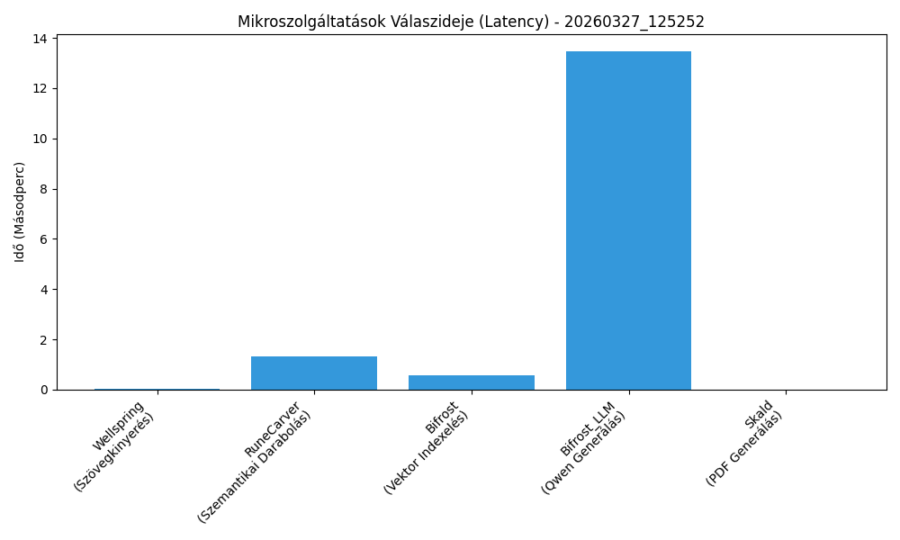

# ⚙️ Projekt Mimir - Átfogó E2E Integrációs Jelentés

**Dátum és Idő:** 2026-03-27 12:53:07
**Végeredmény:** 🟢 SIKERES
**Teljes feldolgozási idő:** 15.387 másodperc

## 📈 Teljesítmény Metrikák (Latency)



## 🧪 Lépésenkénti Eredmények (Audit Log)

| Service     | Lépés                 | Paraméterek                              |   Válaszidő (s) | Státusz   | Elvárás Teljesült   | Hiba   |
|:------------|:----------------------|:-----------------------------------------|----------------:|:----------|:--------------------|:-------|
| Wellspring  | Szövegkinyerés        | Karakterszám: 1221, Metódus: NATIVE_TEXT |          0.0387 | Sikeres   | Igen                | -      |
| RuneCarver  | Szemantikai Darabolás | Legenerált chunkok száma: 3 db           |          1.3032 | Sikeres   | Igen                | -      |
| Bifrost     | Vektor Indexelés      | Qdrant adatbázisba mentve: 3 vektor      |          0.5585 | Sikeres   | Igen                | -      |
| Bifrost_LLM | Qwen Generálás        | Kérdések: 1 db, Formátum: pdf            |         13.4783 | Sikeres   | Igen                | -      |
| Skald       | PDF Generálás         | PDF Fájlméret: 1.71 KB                   |          0.0086 | Sikeres   | Igen                | -      |

## 📝 Tesztelt Adathalmaz

**Bemeneti nyers szöveg (Wellspring):**
```text
Az ókori Egyiptom civilizációja a Nílus folyó völgyében alakult ki. A fáraók, akiket istenként tiszteltek, hatalmas piramisokat építtettek temetkezési helyként, melyek közül a gízai nagy piramis a legismertebb. Az egyiptomiak fejlett öntözéses földművelést és hieroglif írást alkalmaztak.

Az ipari forradalom a 18. század végén indult el Nagy-Britanniából. A folyamat legfontosabb találmánya James Watt tökéletesített gőzgépe volt, amely forradalmasította a textilipart, a bányászatot és a közlekedést. Később a gőzhajók és a gőzmozdonyok megjelenése drasztikusan lecsökkentette az utazási időt.

Az Apollo-11 küldetés során, 1969. július 20-án lépett először ember a Holdra. Neil Armstrong parancsnok és Buzz Aldrin holdkomppilóta több mint két órát töltött a Hold felszínén, miközben Michael Collins a parancsnoki modulban keringett az égitest körül. A küldetés a hidegháborús űrverseny csúcspontja volt.

A fotoszintézis az a biológiai folyamat, melynek során a zöld növények a napfény energiáját felhasználva szervetlen anyagokból (vízből és szén-dioxidból) szerves anyagokat hoznak létre, miközben oxigént bocsátanak ki. A folyamat a kloroplasztiszokban, a klorofill nevű zöld pigment segítségével megy végbe.
```

**Keresési Lekérdezés (Bifrost):** `Ki volt a parancsnok az Apollo-11 küldetés során?`

**Elvárt Keresési Találat:** `Armstrong`


## 🤖 AI Által Generált Teszt (JSON kimenet)

```json
{
    "title": "Mimir AI Teszt",
    "format": "pdf",
    "questions": [
        {
            "type": "mcq",
            "text": "Ki volt a parancsnok az Apollo-11 küldetés során?",
            "answers": [
                {
                    "text": "Neil Armstrong",
                    "is_correct": true
                },
                {
                    "text": "Buzz Aldrin",
                    "is_correct": false
                },
                {
                    "text": "Michael Collins",
                    "is_correct": false
                },
                {
                    "text": "Yuri Gagarin",
                    "is_correct": false
                }
            ]
        }
    ]
}
```
